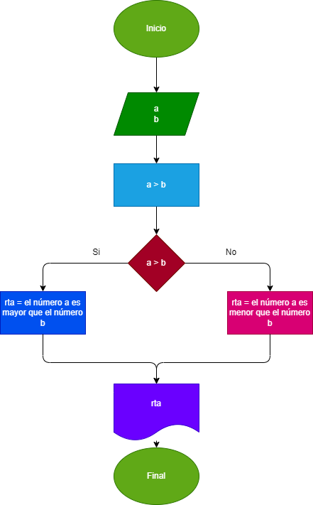
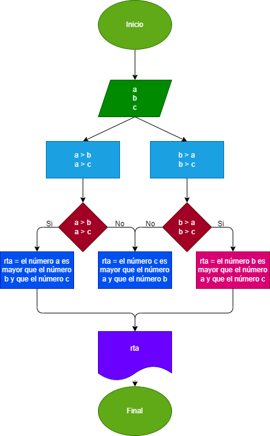
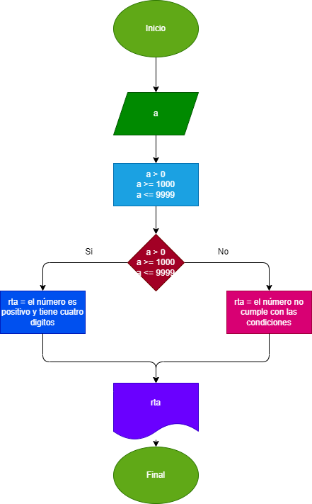

# Trabajo_04_03_23
Verificar si un numero es mayor o menor; si es positivo y de 4 digitos

## Verificar cual de dos número es mayor
## Diagrama de flujo

## Verificar cual de tres números es mayor
## Diagrama de flujo

## Verificar si un número es positivo y de cuatro digitos
## Diagrama de flujo

